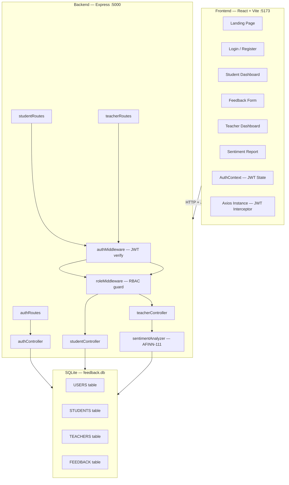

# 🎓 Institute Feedback Analyzer — Implementation Plan

> **Project Type:** Final-Year Full-Stack Web Application  
> **Stack:** React + Vite | Node.js + Express | SQLite | JWT | AFINN NLP  
> **Source:** [Institute_Feedback_Analyzer_PRD.docx](file:///c:/Users/ASUS/OneDrive/Desktop/Miniproject/Institute_Feedback_Analyzer_PRD.docx)

---

## Architecture Overview



---

## Phase 0 — Project Scaffold & Monorepo Setup
**Goal:** Initialize the monorepo so `npm install && npm run dev` boots both client and server.  
**Est. Time:** 30 min

| # | Task | File(s) | Details |
|---|------|---------|---------|
| 0.1 | Create root `package.json` with `concurrently` | `package.json` | Scripts: `"dev": "concurrently \"npm run server\" \"npm run client\""`, `"server": "cd server && node app.js"`, `"client": "cd client && npm run dev"` |
| 0.2 | Scaffold React + Vite frontend | `client/` | `npx -y create-vite@latest client --template react` — then install `axios`, `react-router-dom` |
| 0.3 | Scaffold Express backend | `server/` | `npm init -y` — then install `express`, `cors`, `better-sqlite3`, `bcryptjs`, `jsonwebtoken`, `sentiment`, `dotenv` |
| 0.4 | Create `.env` file | `.env` | `JWT_SECRET=<random>`, `PORT=5000` |
| 0.5 | Add `.gitignore` | `.gitignore` | Ignore `node_modules/`, `.env`, `*.db` |

> [!IMPORTANT]
> The PRD mandates Tailwind CSS for styling. Install it in the Vite client during this phase.

**Acceptance:** Running `npm run dev` at root starts both servers without errors.

---

## Phase 1 — Backend Foundation (Auth + DB Schema)
**Goal:** SQLite schema initialization, Express app scaffold, `/register` and `/login` endpoints with JWT.  
**Est. Time:** 4–6 hrs  
**PRD Refs:** F-04 → F-10, NF-01 → NF-04, NF-10

### 1.1 — Database Schema Init

| # | Task | File | Details |
|---|------|------|---------|
| 1.1.1 | Create SQLite connection module | `server/models/db.js` | Use `better-sqlite3`. Enable WAL mode & foreign keys. |
| 1.1.2 | Create USERS table | `server/models/db.js` | Columns: `id`, `name`, `email` (UNIQUE), `password`, `role` (CHECK IN student/teacher), `created_at` |
| 1.1.3 | Create STUDENTS table | `server/models/db.js` | Columns: `id`, `user_id` (FK → USERS), `roll_no` (UNIQUE), `department`, `attendance` (REAL 0–100) |
| 1.1.4 | Create TEACHERS table | `server/models/db.js` | Columns: `id`, `user_id` (FK → USERS), `subject`, `department` |
| 1.1.5 | Create FEEDBACK table | `server/models/db.js` | Columns: `id`, `student_id` (FK), `teacher_id` (FK), `rating` (CHECK 1–5), `remarks`, `sentiment`, `score`, `submitted_at`. UNIQUE constraint on `(student_id, teacher_id)` |

### 1.2 — Express App & Middleware

| # | Task | File | Details |
|---|------|------|---------|
| 1.2.1 | Create Express entry point | `server/app.js` | Load dotenv, init CORS (origin: `http://localhost:5173`), JSON body parser, register route modules, start on `PORT` |
| 1.2.2 | Create JWT auth middleware | `server/middleware/authMiddleware.js` | Extract `Bearer` token from `Authorization` header, verify with `jwt.verify()`, attach decoded payload to `req.user`. Return 401 on failure. |
| 1.2.3 | Create role-check middleware | `server/middleware/roleMiddleware.js` | Factory function `requireRole(role)` → returns middleware that checks `req.user.role === role`, returns 403 on mismatch. |

### 1.3 — Auth Routes & Controller

| # | Task | File | Details |
|---|------|------|---------|
| 1.3.1 | Create auth routes | `server/routes/authRoutes.js` | `POST /api/auth/register`, `POST /api/auth/login` |
| 1.3.2 | Implement register controller | `server/controllers/authController.js` | Validate fields, hash password (`bcryptjs`, 10 rounds), insert into USERS + role-specific table. Return 201. |
| 1.3.3 | Implement login controller | `server/controllers/authController.js` | Verify email exists, compare password hash, sign JWT with `{ userId, role, name }`, return token. |

**Acceptance Criteria:**
- `POST /api/auth/register` with student data → 201 + user in DB
- `POST /api/auth/register` with teacher data → 201 + user in DB
- `POST /api/auth/login` → 200 + valid JWT
- Duplicate email → 409
- Wrong password → 401

---

## Phase 2 — Student API + Guardrail Logic
**Goal:** Protected student routes with attendance-based guardrail middleware.  
**Est. Time:** 3–4 hrs  
**PRD Refs:** F-11 → F-18, Guardrail Spec §9

### Tasks

| # | Task | File | Details |
|---|------|------|---------|
| 2.1 | Create student routes | `server/routes/studentRoutes.js` | All routes use `authMiddleware` + `requireRole('student')` |
| 2.2 | `GET /api/student/profile` | `server/controllers/studentController.js` | Join USERS + STUDENTS on `user_id`, return name, roll_no, department, attendance |
| 2.3 | `GET /api/student/teachers` | `server/controllers/studentController.js` | Query all teachers (join USERS + TEACHERS), return list for dropdown |
| 2.4 | `POST /api/student/feedback` | `server/controllers/studentController.js` | **GUARDRAIL CHECK**: Fetch student attendance → if `< 60%` AND `rating < 3` → return 403. Run sentiment analysis on remarks. Insert into FEEDBACK. Handle UNIQUE constraint → 409. |
| 2.5 | `GET /api/student/feedback` | `server/controllers/studentController.js` | Return all feedback rows where `student_id` matches logged-in student |

> [!CAUTION]
> **Guardrail is the core differentiator of this project.** The backend MUST independently validate attendance from the database — never trust frontend-submitted attendance values.

**Acceptance Criteria:**
- Profile endpoint returns correct student data
- Feedback with `attendance < 60%` and `rating = 2` → 403
- Feedback with `attendance < 60%` and `rating = 3` → 201 ✓
- Duplicate feedback for same teacher → 409
- Sentiment field populated automatically on insert

---

## Phase 3 — Teacher API + NLP Sentiment Engine
**Goal:** Teacher feedback retrieval and NLP-powered sentiment report generation.  
**Est. Time:** 3–4 hrs  
**PRD Refs:** F-19 → F-29

### Tasks

| # | Task | File | Details |
|---|------|------|---------|
| 3.1 | Create sentiment analyzer utility | `server/utils/sentimentAnalyzer.js` | Wrap `sentiment` npm package. Export `analyze(text)` → `{ score, comparative, classification }`. Classification: score > 0 → "positive", score < 0 → "negative", score === 0 → "neutral" |
| 3.2 | Create teacher routes | `server/routes/teacherRoutes.js` | All routes use `authMiddleware` + `requireRole('teacher')` |
| 3.3 | `GET /api/teacher/profile` | `server/controllers/teacherController.js` | Join USERS + TEACHERS, return name, subject, department |
| 3.4 | `GET /api/teacher/feedback` | `server/controllers/teacherController.js` | Join FEEDBACK + STUDENTS + USERS where `teacher_id` matches. Return: student name, roll_no, department, attendance, rating, remarks, sentiment |
| 3.5 | `GET /api/teacher/report` | `server/controllers/teacherController.js` | Aggregate all feedback for this teacher: total count, average rating, positive/negative/neutral counts, top positive keywords, top negative keywords |

**Acceptance Criteria:**
- Teacher sees only their own feedback (strict isolation)
- Report JSON includes: `totalCount`, `avgRating`, `sentimentBreakdown`, `positiveKeywords`, `negativeKeywords`
- Sentiment analysis runs < 2s for 100 remarks

---

## Phase 4 — Frontend Auth Pages
**Goal:** Landing page, Login, Register with role toggle, AuthContext, protected routing.  
**Est. Time:** 4–5 hrs  
**PRD Refs:** F-01 → F-03, Screen Inventory §10

### Tasks

| # | Task | File | Details |
|---|------|------|---------|
| 4.1 | Create Axios instance with JWT interceptor | `client/src/utils/api.js` | Base URL: `http://localhost:5000/api`. Request interceptor: attach `Authorization: Bearer <token>` from localStorage |
| 4.2 | Create AuthContext | `client/src/context/AuthContext.jsx` | State: `user`, `token`, `isAuthenticated`. Methods: `login()`, `register()`, `logout()`. Persist token to localStorage. Decode JWT for user info. |
| 4.3 | Create ProtectedRoute component | `client/src/components/ProtectedRoute.jsx` | Checks auth + role. Redirects to `/login` if unauthenticated, to `/` if wrong role. |
| 4.4 | Build Landing Page | `client/src/pages/LandingPage.jsx` | Hero section with app description, feature highlights (RBAC, Guardrail, NLP), Sign Up & Login CTAs |
| 4.5 | Build Register Page | `client/src/pages/RegisterPage.jsx` | Role selector toggle (Student/Teacher). Dynamic form: students see roll_no + department + attendance fields; teachers see subject + department. |
| 4.6 | Build Login Page | `client/src/pages/LoginPage.jsx` | Email + password. On success: decode JWT role → redirect to `/student/dashboard` or `/teacher/dashboard` |
| 4.7 | Set up React Router | `client/src/App.jsx` | Define all routes per Screen Inventory. Wrap protected routes with `ProtectedRoute`. |

**Acceptance Criteria:**
- Landing page renders with CTAs
- Register as student → redirects to student dashboard
- Register as teacher → redirects to teacher dashboard
- Login with valid creds → role-aware redirect
- Accessing `/student/*` as teacher → redirected away

---

## Phase 5 — Student Portal UI
**Goal:** Student Dashboard, Feedback Form with guardrail-aware StarRating.  
**Est. Time:** 4–5 hrs  
**PRD Refs:** F-11 → F-18, StarRating Spec §10.1

### Tasks

| # | Task | File | Details |
|---|------|------|---------|
| 5.1 | Build Student Dashboard | `client/src/pages/StudentDashboard.jsx` | Profile card: Name, Roll No, Department, Attendance %. Feedback history table below. |
| 5.2 | Build StarRating component | `client/src/components/StarRating.jsx` | Props: `value`, `onChange`, `minAllowed` (default 1), `disabled`. Stars below `minAllowed`: reduced opacity, `cursor: not-allowed`, tooltip on hover: "Rating restricted due to attendance below 60%" |
| 5.3 | Build Feedback Form | `client/src/pages/FeedbackForm.jsx` | Teacher dropdown (from `/api/student/teachers`). StarRating with `minAllowed = attendance < 60 ? 3 : 1`. Textarea for remarks. Submit button. |
| 5.4 | Handle submission flow | `client/src/pages/FeedbackForm.jsx` | POST to `/api/student/feedback`. Show styled success confirmation on 201. Handle 403 (guardrail), 409 (duplicate) with user-friendly messages. |
| 5.5 | Build Feedback History | `client/src/components/FeedbackHistory.jsx` | Fetch from `GET /api/student/feedback`. Table: Teacher Name, Subject, Rating, Remarks, Date |

> [!WARNING]
> The StarRating component is the **most logic-sensitive UI element** per the PRD. The `minAllowed` prop drives the frontend guardrail — test it thoroughly with attendance values above and below 60%.

**Acceptance Criteria:**
- Dashboard shows correct profile data
- Stars 1 & 2 visually disabled when attendance < 60%
- Tooltip appears on hover over restricted stars
- Successful submission shows confirmation
- Duplicate submission shows 409 error message

---

## Phase 6 — Teacher Portal UI
**Goal:** Teacher Dashboard with feedback table and sentiment report visualization.  
**Est. Time:** 4–5 hrs  
**PRD Refs:** F-19 → F-24, Screen Inventory §10

### Tasks

| # | Task | File | Details |
|---|------|------|---------|
| 6.1 | Build Teacher Dashboard | `client/src/pages/TeacherDashboard.jsx` | Welcome banner with name + subject. Full feedback table below. |
| 6.2 | Build FeedbackTable component | `client/src/components/FeedbackTable.jsx` | Columns: Student Name, Roll No, Department, Attendance %, Rating (stars), Remarks, Sentiment badge |
| 6.3 | Build Sentiment Report page | `client/src/pages/SentimentReport.jsx` | "Generate Report" button → fetches `/api/teacher/report`. Display: summary cards (total, avg rating, sentiment counts), sentiment breakdown chart, keyword lists |
| 6.4 | Build summary cards | `client/src/components/SentimentReport.jsx` | Cards for: Total Feedback, Average Rating, Positive Count, Negative Count, Neutral Count |
| 6.5 | Build keyword display | `client/src/components/SentimentReport.jsx` | Two columns: Positive Keywords (green badges) and Negative Keywords (red badges) |

**Acceptance Criteria:**
- Teacher sees only feedback addressed to them
- Feedback table renders all expected columns
- Report generates with correct aggregate data
- Keyword extraction displays meaningful terms

---

## Phase 7 — Polish & QA
**Goal:** Error handling, form validation, responsive design, edge cases.  
**Est. Time:** 3–4 hrs  
**PRD Refs:** NF-07 → NF-09, NF-13, Risk Register §13

### Tasks

| # | Task | Details |
|---|------|---------|
| 7.1 | Add inline form validation | All registration/login fields: required checks, email format, password length, attendance range (0–100) |
| 7.2 | Add global error handling | Express error middleware for unhandled exceptions → 500 response. React error boundary. |
| 7.3 | Responsive design pass | Ensure all pages work on desktop + tablet viewports (NF-08) |
| 7.4 | Edge case testing | Empty feedback table states, zero feedback report, session expiry handling, CORS verification |
| 7.5 | Loading states & UX | Skeleton loaders for data fetches, disabled buttons during submission, toast notifications |
| 7.6 | Final Tailwind styling | Soft color palette, clean typography, consistent spacing, presentation-ready polish |
| 7.7 | README.md | Setup instructions, tech stack, screenshots, project structure documentation |

---

## Folder Structure (Final)

```
institute-feedback-analyzer/
├── package.json                  # Root — concurrently scripts
├── .env                          # JWT_SECRET, PORT
├── .gitignore
├── client/
│   ├── package.json
│   ├── vite.config.js
│   ├── index.html
│   └── src/
│       ├── App.jsx               # Router setup
│       ├── main.jsx              # Entry point
│       ├── index.css             # Tailwind imports
│       ├── context/
│       │   └── AuthContext.jsx   # JWT state management
│       ├── utils/
│       │   └── api.js            # Axios + JWT interceptor
│       ├── components/
│       │   ├── StarRating.jsx
│       │   ├── ProtectedRoute.jsx
│       │   ├── FeedbackTable.jsx
│       │   ├── FeedbackHistory.jsx
│       │   └── SentimentReport.jsx
│       └── pages/
│           ├── LandingPage.jsx
│           ├── LoginPage.jsx
│           ├── RegisterPage.jsx
│           ├── StudentDashboard.jsx
│           ├── FeedbackForm.jsx
│           ├── TeacherDashboard.jsx
│           └── SentimentReport.jsx
└── server/
    ├── package.json
    ├── app.js                    # Express entry point
    ├── models/
    │   └── db.js                 # SQLite init + schema
    ├── middleware/
    │   ├── authMiddleware.js     # JWT verification
    │   └── roleMiddleware.js     # RBAC guard
    ├── routes/
    │   ├── authRoutes.js
    │   ├── studentRoutes.js
    │   └── teacherRoutes.js
    ├── controllers/
    │   ├── authController.js
    │   ├── studentController.js
    │   └── teacherController.js
    └── utils/
        └── sentimentAnalyzer.js  # AFINN wrapper
```

---

## Dependency Summary

| Package | Layer | Purpose |
|---------|-------|---------|
| `react`, `react-dom` | Client | UI framework |
| `react-router-dom` | Client | Client-side routing |
| `axios` | Client | HTTP client with interceptors |
| `tailwindcss` | Client | Utility-first CSS |
| `express` | Server | REST API framework |
| `cors` | Server | Cross-origin middleware |
| `better-sqlite3` | Server | SQLite driver (zero-config) |
| `bcryptjs` | Server | Password hashing (10 rounds) |
| `jsonwebtoken` | Server | JWT sign/verify |
| `sentiment` | Server | AFINN-111 NLP analysis |
| `dotenv` | Server | Environment variable loading |
| `concurrently` | Root | Run client + server in parallel |

---

## Critical Design Decisions

| Decision | Rationale |
|----------|-----------|
| Backend-first build order (Phases 1–3 before 4–6) | Allows Postman-verified API layer before frontend consumes it |
| Dual-layer guardrail (UI + API) | Frontend = UX; Backend = security. Neither alone is sufficient. |
| SQLite over PostgreSQL | Zero-config, portable `.db` file, ideal for academic submission |
| `sentiment` npm over cloud NLP | Offline, no API keys, sub-ms latency, academically cited AFINN-111 |
| UNIQUE constraint on (student_id, teacher_id) | DB-level duplicate prevention — no race conditions possible |
| Raw SQL over ORM | Transparent queries for learning; no hidden magic |

---

## Total Estimated Time: **26–34 hours**
